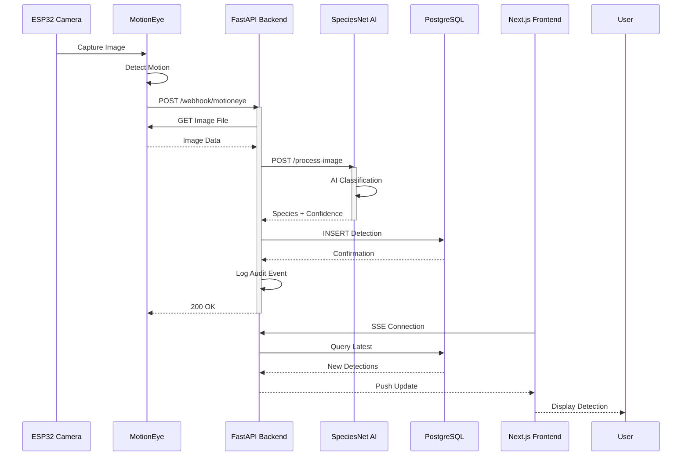
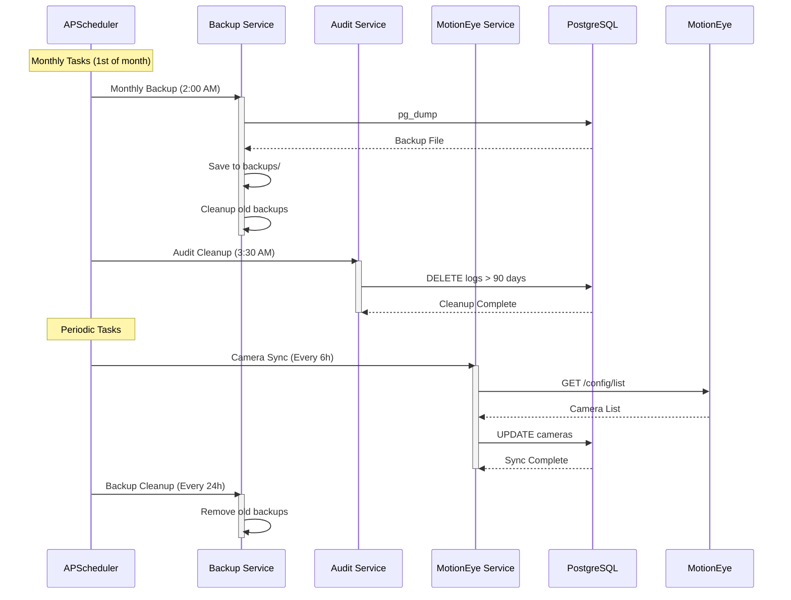
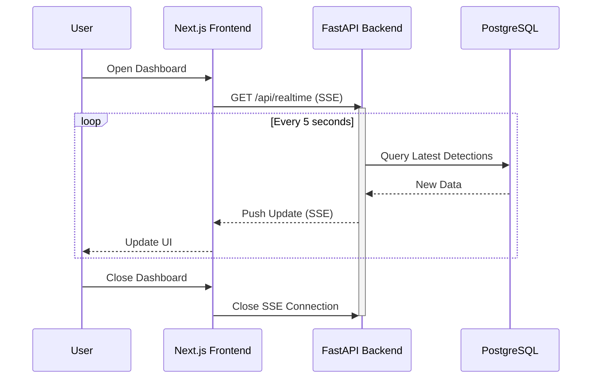
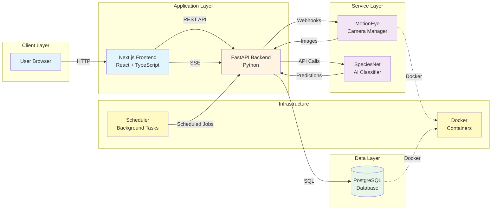

# Wildlife Detection System - Architecture & Workflow Diagrams

## System Architecture Diagram

```mermaid
graph TB
    subgraph "Frontend Layer"
        Frontend[Next.js Frontend<br/>Port 3000]
        Components[React Components]
        APIClient[API Client]
        RealtimeHooks[Real-time Hooks]
    end

    subgraph "Backend API Layer"
        Backend[FastAPI Server<br/>Port 8001]
        Endpoints[API Endpoints]
        RateLimit[Rate Limiting]
        CORS[CORS Middleware]
        Auth[Authentication]
    end

    subgraph "Business Logic Layer"
        MotionEyeService[MotionEye Service]
        SpeciesNetService[SpeciesNet Service]
        BackupService[Backup Service]
        NotificationService[Notification Service]
        SchedulerService[Scheduler Service]
        WebhookService[Webhook Service]
        AuthService[Auth Service]
        AuditService[Audit Service]
    end

    subgraph "Data Layer"
        Database[(PostgreSQL Database<br/>with pg_mooncake)]
        DetectionsDB[Detections Table]
        CamerasDB[Cameras Table]
        AuditDB[Audit Logs Table]
        UsersDB[Users Table]
        WebhooksDB[Webhooks Table]
    end

    subgraph "External Services"
        MotionEye[MotionEye<br/>Docker<br/>Port 8765]
        SpeciesNet[SpeciesNet Server<br/>Port 8000]
        Cameras[ESP32 Cameras]
        Notifications[Email/SMS]
    end

    subgraph "Scheduled Tasks"
        MonthlyBackup[Monthly Backup<br/>1st at 2 AM]
        AuditCleanup[Audit Cleanup<br/>1st at 3:30 AM]
        BackupCleanup[Backup Cleanup<br/>Every 24h]
        CameraSync[Camera Sync<br/>Every 6h]
        HealthChecks[Health Checks<br/>Every hour]
        Reports[Report Generation<br/>Monday 8 AM]
    end

    Frontend --> Components
    Frontend --> APIClient
    Frontend --> RealtimeHooks
    APIClient --> Backend
    RealtimeHooks --> Backend

    Backend --> Endpoints
    Backend --> RateLimit
    Backend --> CORS
    Backend --> Auth
    Endpoints --> MotionEyeService
    Endpoints --> SpeciesNetService
    Endpoints --> BackupService
    Endpoints --> NotificationService
    Endpoints --> WebhookService
    Endpoints --> AuthService
    Endpoints --> AuditService
    Endpoints --> Database

    MotionEyeService --> MotionEye
    SpeciesNetService --> SpeciesNet
    BackupService --> Database
    NotificationService --> Notifications
    WebhookService --> Notifications
    AuthService --> Database
    AuditService --> Database

    DetectionsDB --> Database
    CamerasDB --> Database
    AuditDB --> Database
    UsersDB --> Database
    WebhooksDB --> Database

    SchedulerService --> MonthlyBackup
    SchedulerService --> AuditCleanup
    SchedulerService --> BackupCleanup
    SchedulerService --> CameraSync
    SchedulerService --> HealthChecks
    SchedulerService --> Reports
    MonthlyBackup --> BackupService
    AuditCleanup --> Database
    BackupCleanup --> BackupService
    CameraSync --> MotionEyeService
    HealthChecks --> MotionEye
    HealthChecks --> SpeciesNet
    Reports --> Database

    MotionEye --> Cameras
    MotionEye -.Webhooks.-> Backend
    SpeciesNet -.API Calls.-> Backend

    style Frontend fill:#e1f5ff
    style Backend fill:#fff4e1
    style Database fill:#e8f5e9
    style MotionEye fill:#f3e5f5
    style SpeciesNet fill:#f3e5f5
    style SchedulerService fill:#fff9c4
```

## Image Detection Workflow

## Scheduled Tasks Workflow

## Real-time Updates Flow

## System Components Overview

## Data Flow Summary

1. **Image Capture**: ESP32 Camera → MotionEye
2. **Motion Detection**: MotionEye detects motion, triggers webhook
3. **Webhook Processing**: Backend receives webhook, fetches image
4. **AI Classification**: Backend sends image to SpeciesNet
5. **Data Storage**: Backend stores detection in PostgreSQL
6. **Real-time Updates**: Frontend receives updates via Server-Sent Events
7. **User Display**: Frontend displays detections in dashboard

## Key Technologies

- **Frontend**: Next.js 15, React, TypeScript, Tailwind CSS
- **Backend**: FastAPI, Python 3.11+, SQLAlchemy
- **Database**: PostgreSQL 17, pg_mooncake (columnstore analytics)
- **Camera Integration**: MotionEye (Docker)
- **AI Classification**: SpeciesNet (TensorFlow)
- **Scheduling**: APScheduler
- **Real-time**: Server-Sent Events (SSE)

## Port Configuration

| Service | Port | Protocol |
|---------|------|----------|
| Next.js Frontend | 3000 | HTTP |
| FastAPI Backend | 8001 | HTTP |
| SpeciesNet Server | 8000 | HTTP |
| MotionEye | 8765 | HTTP |
| PostgreSQL | 5432 | TCP |

